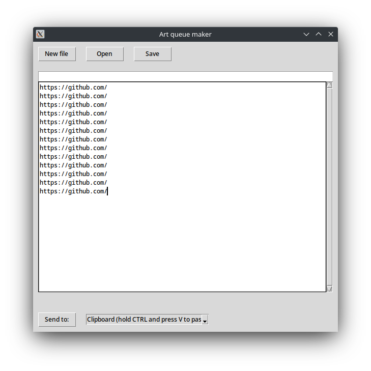

# Art queue maker (Python)
 Better version of the WPF/C# kind (https://github.com/AceOfSpadesProduc100/Art-Queue-Maker), made in Tkinter

Manage a list of links to send to either archive.today or the clipboard to paste onto Discord, Telegram, etc.
